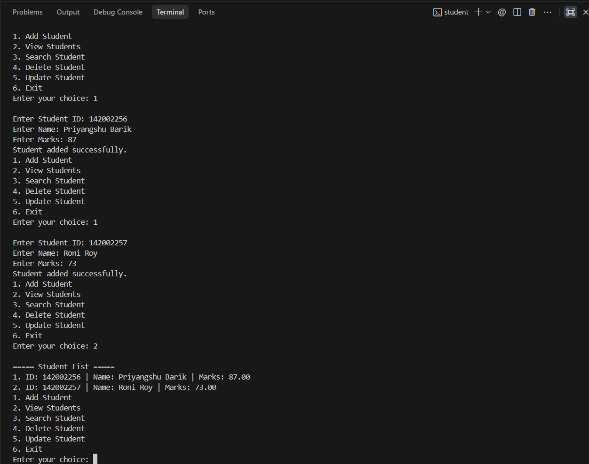
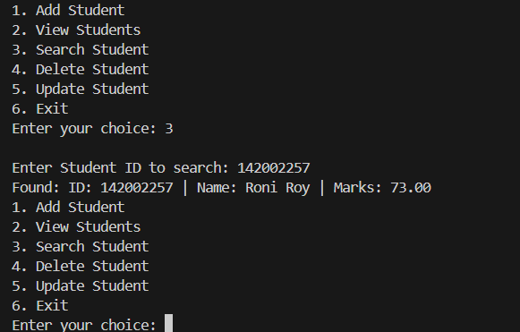
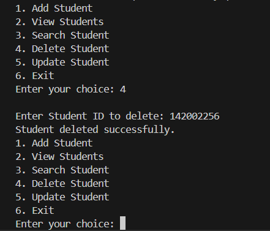

# 🎓 Student Management System in C

## 📌 Description
This is a console-based Student Management System built using the C programming language. It allows users to manage student records efficiently through a menu-driven interface.

The system supports adding, viewing, searching, updating, and deleting student data during program execution.

---

## 🚀 Features
- Add new student records  
- View all students  
- Search student by ID  
- Update student details  
- Delete student records  
- Menu-driven interface for easy use  

---

## 🛠️ Tech Stack
- C Programming  
- Standard Library (`stdio.h`, `string.h`)  

---

## ▶️ How to Run

1. Compile the program:
```bash
gcc student.c -o student
```
## 📸 Output Preview
- Add Student :-

- View Student :-


- Delete Student :-


